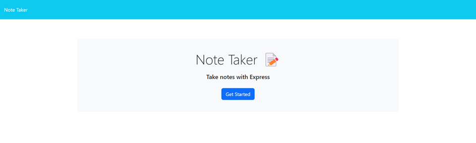
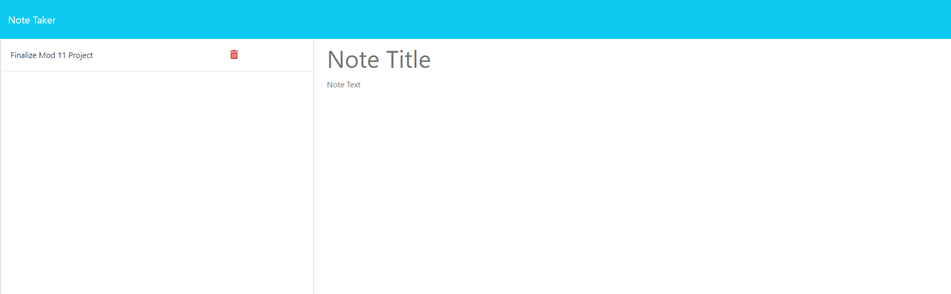
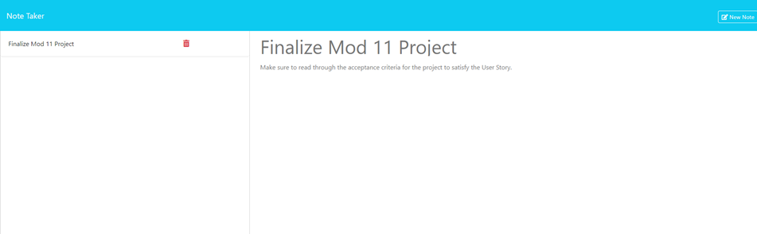

# Note Taker 
## Description
An application that allows users to record and save notes so they can organize their thoughts and keep track of tasks they need to complete.
## Table of Contents
- [Features](#features)
- [Usage](#usage)
- [Contributing](#contributing)
- [Tests](#tests)
- [Questions](#questions)
- [Credits](#credits)
- [License](#license)
## Features

1. Landing Page

    * Upon navigating to the application's URL, the user will see a landing page that allows them to toggle between their notes and the landing page.

2. Note Taker

    * Clicking on the "Get Started" button on the landing page will navigate the user to the Note Taker page that allows them to create and save notes. Once on the Note Taker page, clicking on "Note Taker" located at the top left of the page will nagivate the user back to the landing page.

3. Save Note

    * On the Note Taker page, when the user enters text into the "Note Title" and "Note Text" sections, a "Save Note" button appears, allowing them to save the note for future reference.

4. Clear Form

    * When creating a new note, if there is text present in either the "Note Title" or "Note Text" sections, a "Clear Form" button will appear allowing the user to clear the form with one click as needed.

5. Show Note

    * While the user is on the Note Taker page, if there are any saved notes, the user can click the note to have the note title and note text render in the section to the right of the saved notes.

6. Delete Button

    * When a user saves a note, they will notice a red trash can icon appear next to the note. The user can click this icon to delete that note.

7. Technologies Used

    * HTML5
    * CSS
    * JavaScript
    * Nodemon
    * Express.js
    * Node.js
    * VS Code
    * GitBash
    * Heroku
    * Heroku CLI

## Usage
To use this app, click [here](https://note-taker-jmp-5dc91171bb01.herokuapp.com/).

To view this projects GitHub repository, click [here](https://github.com/JoshMassa/note-taker).

The Landing Page should resemble the following image:

The Note Taker page should resemble the following image:

When clicking on a saved note, the Note Taker page should resemble the following image:

## Contributing
1. Fork the repository 
 2. Create a new branch for your contribution 
 3. Make your changes and commit them 
 4. Push your local branch to the remote repository and submit a pull request
## Tests
There are currently no tests for this application.
## Questions
You can find my GitHub profile [here](https://www.github.com/JoshMassa). 

If you have any questions, you can email me by clicking [here](mailto:joshuamassapelleter@outlook.com).
## Credits
[Deploying a node.js app on Heroku](https://devcenter.heroku.com/articles/deploying-nodejs) 
[Installing and using uuid](https://www.npmjs.com/package/uuid)
## License
This project is covered by &nbsp;&nbsp;